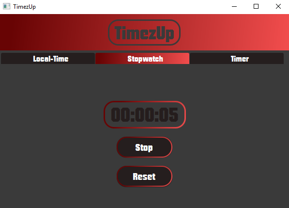
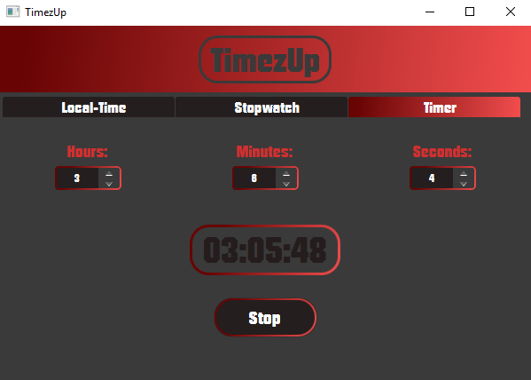

# TimezUp
A JavaFX-TimeApp which is comparable to Smartphone-Clock-Apps. It features your Local-Time, a stopwatch and a timer. It is very simple and doesn't include any further possibilities than necessary.

 

### Included Features
- your local time
- Stopwatch with Start/Stop and Reset-Button
- Timer in HH:MM:SS
- easy to use UI

### Possible future Features
- Get time by timezone (Select Region)
- a calendar
- history of the last stopwatch times
- stopwatch-continue-button

## Known Errors
I have a unfixed error when resizing the window
-> window.setResizable(false) changed the whole layout of my applet
